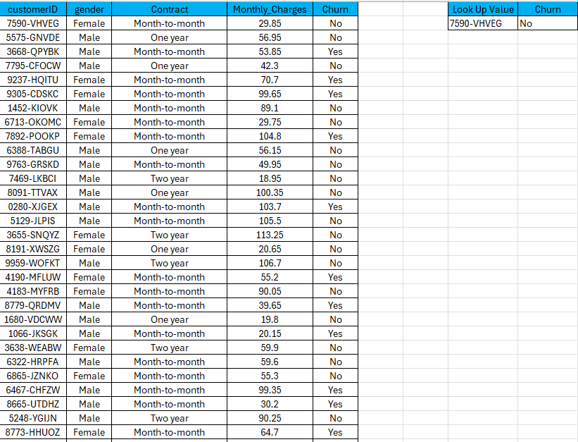

# Customer Churn Analysis – Excel Project

This Excel-based churn analysis simulates the work of a Customer Success or Operations Analyst. It uses logic-driven formulas to flag at-risk customers based on tenure, service engagement, and total charges. It also includes a customer ID lookup tool for fast insights.

---

## Repository Contents

- `/Data File` – Contains final workbook with data, formulas, and segmentation Customer Churn Project.xlsx` 
- `/images/` – Screenshots of enriched dataset, churn risk logic, and lookup tool  
- `README.md` – Overview of project purpose, logic, and Excel skills used

---

## What This Workbook Shows

- Validated Total Charges using `ISNUMBER()` and `IFERROR()`
- Segmented customers by:
  - Tenure Group (New, 1–2 Years, 2–4 Years, 4+ Years)
  - Service Level (Low Service vs. Multi-Service)
  - Risk Flag (High Risk if new & low service)
- Added secondary risk factors:
  - Monthly Charge Tier (High/Medium/Low)
  - Contract Type Risk (e.g., Month-to-Month = Higher Risk)
- Combined all factors into a Final Churn Profile
- Created a lookup tool tab with `XLOOKUP()` for fast customer insights
- Uses TEXT(), IF(), AND(), and OR() to format and flag conditions

---

## Insight & Business Value

This workbook mirrors real Excel-based analysis used by Customer Success and Operations teams:

- **Retention Targeting**: Flags new, low-engagement customers with high churn risk
- **CSM Enablement**: Provides a fast, filterable lookup tool for customer profiles
- **Decision Support**: Combines logic into a churn profile to guide renewal strategy

> This type of work is core to how teams using Gainsight or Salesforce prioritize outreach — especially when predictive models aren’t available.

---

## Formula Logic Documentation

- `ISNUMBER()` – Validates numeric values
- `IFERROR()` – Prevents formula errors
- `COUNTIF()` – Counts engaged services
- `IF()` , `AND()` , `OR()  – Used for Churn Risk Rules
- `XLOOKUP()` – Powers the customer lookup tool

>Formula logic and table views are included as screenshots in /images.

---

## File Structure

| Sheet Name                      | Description                                         |
|--------------------------------|-----------------------------------------------------|
| `Customer Churn Project Table` | Main dataset with formulas and risk segmentation  |
| `Formulas used in Project Table` | Step-by-step logic explanations (with examples)                |
| `Customer Churn Look Up Tool`  | ID-based search tool using XLOOKUP()           |
| `Formulas Used in Look Up Tool`| Supporting logic for the lookup tab                |

---
## Table Preview

**Final Churn Profile Table**

**Lookup Tool Example**

---

## Why This Matters

This type of analysis reflects the real work Customer Success Ops Analysts do to:

- Identify at-risk customers using business rules
- Help Customer Success Managers act quickly with filters and flags
- Reduce churn with proactive segmentation and insights

---

## Created By

**Aaron Zeug**  
Aspiring Data Analyst with CX + Ops background  
[GitHub Profile](https://github.com/Gray135) • [LinkedIn](https://www.linkedin.com/in/aaronzeug)
